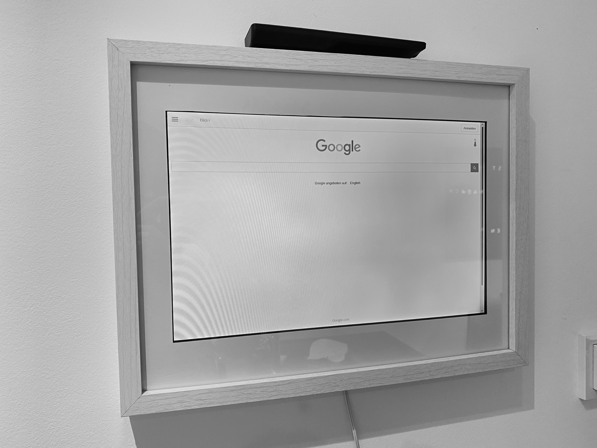

# Raspberry_Pi_Kiosk_Display
 Displays a given URL in Fullscreen mode and hides the mouse pointer, aswell as the navigation bar in the browser.

## Demo
This monitor is connected to a **Raspberry Pi 4** via the HDMI port: 

### Please note
:bangbang: Only tested on a Raspbarry Pi 4 using a HDMI-attatched monitor.

## Installation
1) Simply clone this repository to your Raspberry Pi user folder, first execute `cd /home/pi` and the `git clone https://github.com/JulKramer3G/Raspberry_Pi_Kiosk_Display.git`
2) Go inside the project directory `cd /home/pi/Raspberry_Pi_Kiosk_Display`
3) Run the setup script: `sudo bash setup.sh`
4) Specify the desired website by placing the URL in the file `website.txt`, :bangbang: Make sure your URL is in the **first line** of the text file (just like the already existing *google.com*)
5) If the script shows its done, restart by executing `restart now`

:bangbang: If you want to **update the URL in the future**, you only need to do **step 4 and 5**. 

## Advanced settings
If you want to drive your HDMI attatched monitor using a predefined resolution (because the content is stretched or unsharp), uncomment the lines in file `scripts/setup_system.sh` and set your resolution and / or refresh rate there. 
